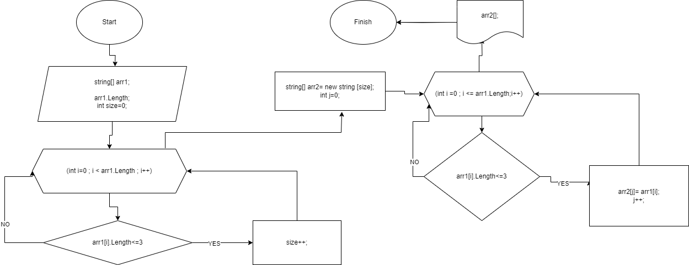

# Итоговая аттестация Синичкина Михаила Михайловича

# Исходное задание :

Задача алгоритмически не самая сложная, однако для полноценного выполнения проверочной работы необходимо:

1. Создать репозиторий на GitHub
2. Нарисовать блок-схему алгоритма (можно обойтись блок-схемой основной содержательной части, если вы выделяете её в отдельный метод)
3. Снабдить репозиторий оформленным текстовым описанием решения (файл README.md)
4. Написать программу, решающую поставленную задачу
5. Использовать контроль версий в работе над этим небольшим проектом (не должно быть так, что всё залито одним коммитом, как минимум этапы 2, 3, и 4 должны быть расположены в разных коммитах)

Задача: Написать программу, которая из имеющегося массива строк формирует новый массив из строк, длина которых меньше, либо равна 3 символам. Первоначальный массив можно ввести с клавиатуры, либо задать на старте выполнения алгоритма. При решении не рекомендуется пользоваться коллекциями, лучше обойтись исключительно массивами.

Примеры:
[“Hello”, “2”, “world”, “:-)”] → [“2”, “:-)”]
[“1234”, “1567”, “-2”, “computer science”] → [“-2”]
[“Russia”, “Denmark”, “Kazan”] → []

# Ход работы :

* Создал локальный репозиторий "ItogovayRabota".
* Создал одноименный репозиторий на GitHub.
* Создал файл README.md, закомитили и запушили.
* Построил блок-схему в draw.io.
* Прописал код .
# Комментарии по решению задачи :
* Вставил в фаил ReadMe картинку нашей блок схемы :

* Задал массив строк, который будет являться исходным, и переменную size, равную 0.
Используя цикл for, мы проходимся по массиву: 
если наше условие выполняется(количество символов не привышает 3), то прибавляем к size + 1, 
Пройдя цикл for, мы знаем размер нашего нового массива,
в который мы будем записывать будущие значения .
* Следующим шагом пишем метод по созданию нового массива. На вход принимаем изначальный массив строк.
Создаем новый массив строк, с уже известным нам размером.
Задаем переменную "j=0" .Используя Цикл for, проходимся по первоначальному массиву. Если  условия выполняется , записываем данную информацию в новый массив.
Возвращаем готовый массив.
* Далее пишем метод по выводу масива .
* Создаем новый массив с помощью метода NewArray(arr1) и выводим с помощью  PrintArr2(Array).

